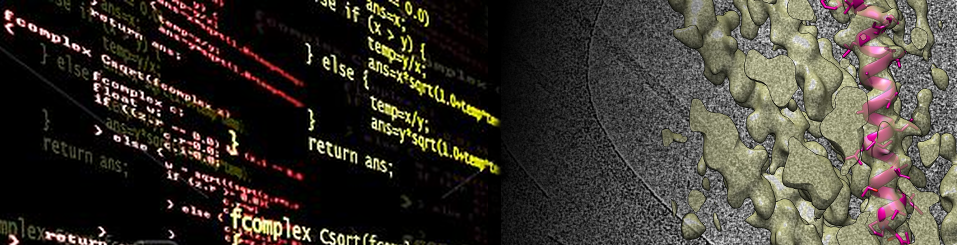

# UCSB: iQB2 - Structural Biology Modlule

## General Information

|               | Name                  | Email                    | 
----------------|-----------------------|--------------------------|
|**Instructor** | Niels Volkmann        | nvo@ucsb.edu             | 
|**TA**         | Trent Llewellyn       | trentllewellyn@ucsb.edu  |
|               |                       |                          |
|**Location**   | Bio II 1160           |                          |

## iClicker
We will use iClicker in class starting on Thursday 11/14. If you have not already done so, please make sure you have a UCSB iClicker student account ready. 
Here is a [link](https://help.lsit.ucsb.edu/hc/en-us/articles/360054938191-iClicker-Cloud-for-Students) with the pertinent information. 
The join link for the course is [here](https://join.iclicker.com/YPHM). If the ink does not work, try searching for "iQB2 - Structural Biology Module" in the iClicker search interface. 
Be aware that the in-class iClicker activities will count towards your grades. I will give credit for participation only, the correctness of the answers will not influence the grades. 

## Grading
20% Participation including iClicker polls and quizzes, 25% Practicals, 25% Presentation, 30% written Homework

## Presentation Format
15 minutes presentation (sharp), + 5 minutes for questions. Papers can either be selected from the list provided 
[here](https://www.dropbox.com/scl/fo/kv4v3au5fki352e3mszg8/h?rlkey=8nesful6u3hpb1r26u5x9wdly&dl=0) (first come first serve) 
or from the general literature upon approval by the instructor. 

## Course Schedule
The following is the approximate schedule for this course. Exact order is subject to change.

|Day	| Date	| 10:00-10:50	| 10:50-11:05	| 11:05-12:00	| 12:00-1:00 | 1:00-4:00  |
|-----|-------|-------------|-------------|-------------|------------|------------|
|Tuesday	| 11/12	| Lecture	| Short Break	| Lecture	| Lunch Break	| Processing Practicals |
|Thursday	| 11/14	| Lecture	| Short Break	| Lecture	| Lunch Break	| Processing Practicals |
|Friday	| 11/15	| Lecture	| Short Break	| Lecture	| Lunch Break	| CryoEM Sample Prep Lab Visit |
|Monday	| 11/18	| Lecture	| Short Break	| Lecture	| Lunch Break	| Processing Practicals |
|Tuesday	| 11/19	| Lecture	| Short Break	| Lecture	| Lunch Break	| Processing Practicals |
|Thursday	| 11/21	| Lecture	| Short Break	| Presentations	| Lunch Break	| Presentations |
|Friday	| 11/22	| Lecture	| Short Break	| Practicals	| Lunch Break	| CryoEM Facility Visit |

